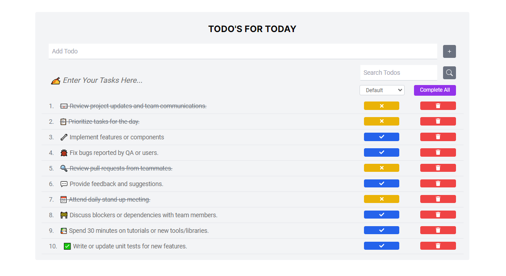

# Todo List App

This is a simple and interactive Todo List application built using Vite, React, Redux, and Tailwind CSS. It allows users to add, edit, and delete tasks, providing a seamless experience for managing daily tasks.

## Features

- **Add Tasks**: Easily add new tasks to your todo list.
- **Edit Tasks**: Update existing tasks with new information.
- **Delete Tasks**: Remove tasks that are no longer needed.
- **Task Completion**: Mark tasks as completed or pending.
- **Responsive Design**: Optimized for both desktop and mobile devices using Tailwind CSS.

## Tech Stack

- **Vite**: Next-generation frontend tooling for blazing fast builds.
- **React**: A JavaScript library for building user interfaces.
- **Redux**: A predictable state container for JavaScript apps.
- **Tailwind CSS**: A utility-first CSS framework for rapid UI development.

## Live Preview


Check out the live preview of the Todo List App:[Live Preview](https://todos-applist.netlify.app/)

## Getting Started

### 1.Prerequisites

- Make sure you have the following installed on your system:
- [Node.js](https://nodejs.org/en/learn/getting-started/introduction-to-nodejs) (v14 or later) installed on your machine.
- [npm](https://www.npmjs.com/) (v6 or later) or [yarn](https://yarnpkg.com/) installed.

### 2. Installation

Clone the Repository:

```bash
git clone https://github.com/im-ravira/todo-list-app.git
cd todo-app 
```

### 3.Install Dependencies

Using npm:

```bash
npm install 
```

Using yarn:

```bash
yarn install
```

### 4.Running the Application

To start the development server, run:

Using npm:

```bash
npm run dev
```

Using yarn:

```bash
yarn dev
```

Open your browser and navigate to `http://localhost:3000` to see the app in action.

### 5.Building the Application

To build the app for production, run:

Using npm:

```bash
npm run build 
```

Using yarn:

```bash
yarn build 
```

The optimized and minified files will be generated in the `dist` directory.

## Project Structureplaintext

```bash
todo-app
├── **public**                  # Static files
├── **src**                     # Source files
│   ├── **assets**              # Assets like images, fonts, etc.
│   ├── **components**          # Reusable components
│   ├── **features**            # Redux features (slices)
│   ├── **pages**               # Page components
│   ├── **App.jsx**             # Root component
│   ├── **index.css**           # Global styles
│   └── **main.jsx**            # Entry point
├── **.gitignore**              # Git ignore file
├── **index.html**              # Main HTML file
├── **package.json**            # NPM package file
├── **README.md**               # Project README file
├── **tailwind.config.js**      # Tailwind CSS configuration
├── **vite.config.js**          # Vite configuration
└── **postcss.config.js**       # PostCSS configuration
```

## Contributing

Contributions are welcome! Please fork the repository and use a feature branch. Pull requests are warmly welcome.

1. Fork the repository
2. Create your feature branch (`git checkout -b feature/AmazingFeature`)
3. Commit your changes (`git commit -m 'Add some AmazingFeature'`)
4. Push to the branch (`git push origin feature/AmazingFeature`)
5. Open a pull request

## License

This project is licensed under the MIT License.

## Contact

For any questions or feedback, please reach out to me at [email](imravira@gmail.com) or visit my GitHub profile at [github.com/im-ravira](https://github.com/ravira-01).
